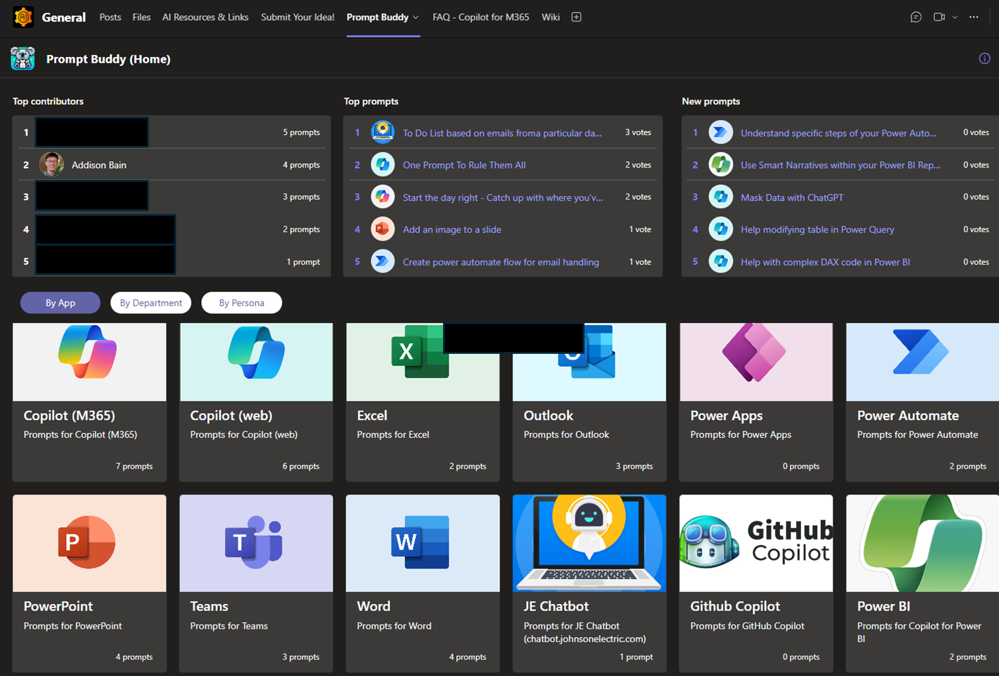

##  Overview
Deployed from Prompt Buddy app, you get a space in Microsoft Teams the AI Community (across the organisation) can share and discover their favourite AI prompts.  The app is preloaded with Microsoft Copilot, and other categories, but we have added more categories based on the various AI apps that people are using.

It's really easy to use and by giving your favourite prompts a ❤️, it raises the most impactful prompts to the top of the leaderboard!

It supports dark mode 🖤 and offers a mobile layout when using Teams on your phone📲. 
Prompt Library is a Teams application built on the Power Platform (Power Apps - Dataverse for Teams)

Once installed, it can be [customized and extended](https://docs.microsoft.com/en-us/powerapps/teams/customize-sample-apps).
